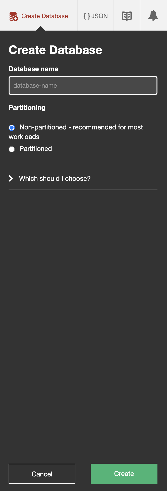

## Работа с CouchDB + PouchDB

Сначала скачиваем CouchDB и запускаем, далее делаем следующее следующее:

1. Создаём базу данных "rep1"

2. Добавляем док с требуемыми полями
 

3. Получаем следующее
 

4. Для доступа используем настройки для CORS
 

5. Проверяем html (приложенный ниже). Т.е. запускаем его и нажимаем sync, получаем
 

6. Проверяем, что происходит при остановке бд. Т.е. что фамилия осталась и созраняем результат (файл index.html)

[Файл html, полученный в результате](index.html)

[Результат можно посмотреть тут (github pages)](https://denis-zierpka.github.io/DB_Sbertech/)
