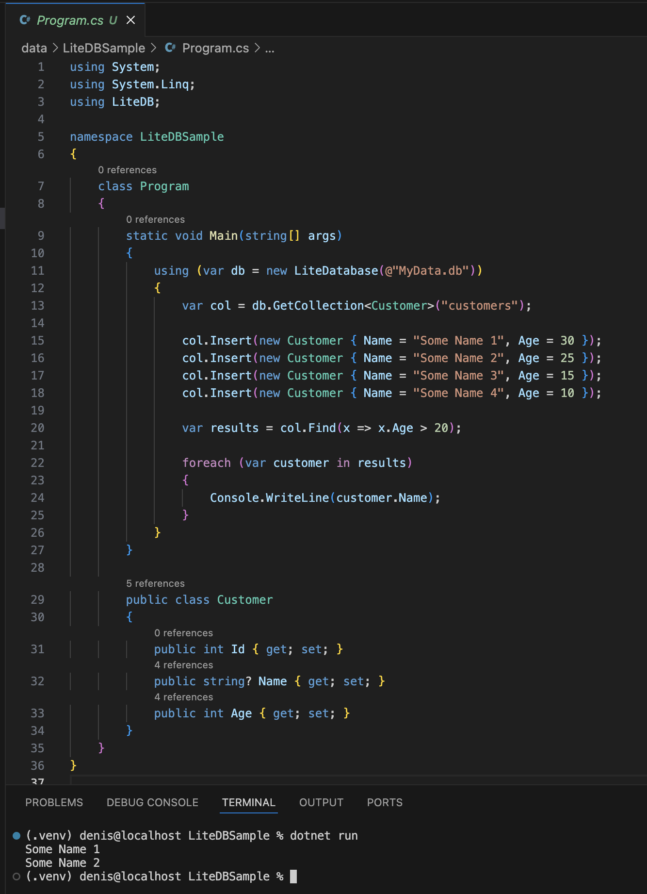

# Изучение работы с Document + LiteDB

Перед тем, как ответить на вопросы коротко рассмотрим что такое LiteDB..

**LiteDB** - это легковесная встраиваемая документо-ориентированная база данных, написанная на C# для .NET. Она предоставляет простой API для хранения и извлечения документов, работает с файлами и не требует установки сервера.


## a. История развития СУБД

LiteDB была разработана [Маурисио Дэвидом (Mauricio David)](https://github.com/mbdavid) как проект с открытым исходным кодом. Разработка началась в начале 2015 года, и первоначальной целью было создать простую и легкую в использовании базу данных для .NET приложений, как альтернатива SQLite, которая могла бы хранить данные без необходимости сложной настройки и управления сервером.

Первые версии LiteDB были сосредоточены на создании базовой функциональности, включая возможности **CRUD, индексацию и простой запросный язык**. LiteDB использовала один файл для хранения данных, что упрощало развертывание и резервное копирование.

Со временем LiteDB получила множество улучшений, включая поддержку более сложных запросов, улучшенную производительность и оптимизацию хранения данных. Также были добавлены новые функции, такие как **транзакции, поддержка шифрования, репликация и восстановление**.

LiteDB продолжает активно развиваться, сообщество вносит свой вклад в разработку новых функций и устранение ошибок, ее исходный код доступен на [GitHub](https://github.com/mbdavid/LiteDB)


## b. Инструменты для взаимодействия с СУБД

LiteDB предоставляет ряд инструментов и интерфейсов для взаимодействия с базой данных. Вот некоторые из них:

1. [LiteDB Shell](https://github.com/mustakimali/LiteDB.Shell.NetCore) - консольное приложение
2. [LiteDB Studio](https://github.com/mbdavid/LiteDB.Studio) и [LiteDB Manager](https://github.com/cccsdh/LiteDB-Manager) - графические интерфейсы пользователя для запросов, управления, просмотра и редактирования документов
3. [LiteDB Explorer](https://github.com/JosefNemec/LiteDbExplorer) - простой инструмент для просмотра и редактирования (базовый интерфейс)
4. LiteDB можно использовать через [NuGet](https://www.nuget.org) пакет в .NET проектах
5. Есть кроссплатформенная утилита, предоставляющая графический интефейс взаимодействия для LiteDB 5+ - [OneBella](https://github.com/namigop/OneBella)
6. При желании (а оно есть) можно работать с LiteDB из Python, нужно будет использовать .NET библиотеки через интерфейс, который позволяет Python взаимодействовать с .NET средой. Один из таких интерфейсов - это pythonnet (также известный как Python for .NET)

## c.	Какой database engine используется в вашей СУБД?

LiteDB использует собственный engine, написанный на C# для .NET. Он представляет собой легковесную и самодостаточную систему управления базами данных, которая не требует внешних зависимостей или установки отдельного сервера баз данных, работает напрямую с файлами на диске.


## d.	Как устроен язык запросов в вашей СУБД? Разверните БД с данными и выполните ряд запросов. 

LiteDB использует LINQ подобные выражения (Language Integrated Query) для запросов к документам.

Как устроен язык запросов:

1. LINQ-подобные запросы

   Можно использовать выражения LINQ для построения запросов, что позволяет легко фильтровать, сортировать и проецировать данные. LiteDB поддерживает множество операций LINQ, включая Where, OrderBy, Select, и многие другие.

2. Лямбда-выражения

   Запросы в LiteDB часто используют лямбда-выражения для определения условий фильтрации и выборки данных.

3. BsonExpression:

   LiteDB также позволяет использовать [BsonExpression](https://www.litedb.org/docs/expressions/) для запросов, которые не поддерживаются нативно через LINQ.


Для развёртывания БД необходимо:

1. Скачать и установить .NET Core SDK
2. Далее создаём проект через `dotnet new console -o LiteDBSample` 
3. Добовить пакет LiteDB в проект (внутри директории: `dotnet add package LiteDB`)
4. Код для взаимодействия с БД в файле [Program.cs](./data/LiteDBSample/Program.cs)
5. Для запуска, команда: `dotnet run`




Есть вариант через python, будет ниже

## e.	Распределение файлов БД по разным носителям?
LiteDB разработана для простоты и легкости использования, и поэтому она не использует сложную многофайловую структуру, как некоторые другие системы управления базами данных. Все данные, включая коллекции, индексы и транзакции, **хранятся в одном файле** .db, что делает управление базой данных очень простым.

Так как база данных представлена одним файлом, ее легко распределять между разными устройствами или носителями.
 
Размещение файла базы данных на SSD может значительно улучшить производительность, поскольку SSD обеспечивают более высокую скорость передачи данных и меньшее время доступа по сравнению с HDD.

Что касается встроенных средств для синхронизации или репликации данных между разными носителями или экземплярами базы данных, LiteDB их **не предоставляет**. Если требуется репликация, это должно быть реализовано на уровне приложения или с использованием внешних инструментов.


## f.	На каком языке/ах программирования написана СУБД?
Как уже сказано ранее, LiteDB написан на C#


## g.	Какие типы индексов поддерживаются в БД? Приведите пример создания индексов.


LiteDB поддерживает несколько типов индексов, которые помогают ускорить операции поиска и выборки данных в базе данных:

1. Основной индекс (Primary)

   Автоматически создается для поля id уникальным для каждого документа

2. Вторичные индексы (Secondary)

   Создаются для полей документов, по которым часто выполняются запросы. Они не обязательно уникальны и могут быть использованы для ускорения поиска по определенным критериям.

3. Уникальные индексы (Unique)

   Гарантируют, что каждое значение в индексе встречается только один раз. Они полезны, когда нужно обеспечить уникальность значений в определенном поле, например, для адресов электронной почты или пользовательских имен.

4. Индексы для массивов (Array)

   LiteDB позволяет индексировать массивы данных, что ускоряет поиск по элементам массива.

5. Индексы для словарей (Dictionary)

   Также поддерживается индексация словарей (ключ-значение), что позволяет эффективно выполнять запросы по ключам словаря.


Для создания индексов в LiteDB можно использовать метод `EnsureIndex` объекта коллекции. 

Вот пример кода, который демонстрирует создание индексов (на C#):


```
using(var db = new LiteDatabase(@"MyData.db"))
{
    var col = db.GetCollection<Customer>("customers");

    // Создание вторичного индекса для поля Name
    col.EnsureIndex(x => x.Name);

    // Создание уникального индекса для поля Email
    col.EnsureIndex(x => x.Email, true);

    // Создание индекса для элементов массива Tags
    col.EnsureIndex(x => x.Tags, "$.Tags[*]");

    // Создание индекса для ключей словаря Attributes
    col.EnsureIndex(x => x.Attributes, "$.Attributes[*]");
}

public class Customer
{
    public int Id { get; set; }
    public string Name { get; set; }
    public string Email { get; set; }
    public string[] Tags { get; set; }
    public Dictionary<string, string> Attributes { get; set; } 
}
```


## h.	Как строится процесс выполнения запросов в вашей СУБД?

1. Подготовка запроса

   Запрос LINQ-подобного синтаксиса преобразуется во внутреннее представление.Лямбда-выражения компилируются в выражения BsonExpression. Т.е преобразования к виду, который может быть интерпретирован движком LiteDB.

2. Определение индексов

   Существуют ли индексы, которые могут быть использованы для ускорения выполнения запроса? Если да, он используется. В случае отсутствия LiteDB будет выполнять полный поиск по коллекции.

3. Исполнение запроса

4. Возврат результатов

5. Транзакции (до 4-ой версии)

   LiteDB поддерживает ACID транзакции, что означает, что запрос либо полностью выполняется, либо полностью откатывается в случае ошибки.


## i.	Есть ли для вашей СУБД понятие «план запросов»? Если да, объясните, как работает данный этап.

LiteDB не имеет сложного оптимизатора запросов, соответсвенно не предоставляет план запросов, как в больших СУБД. Но разработчик может анализировать производительность запросов. Одна из немногоих базовых оптимизаций заключается в использовании индексов.


## j.	Поддерживаются ли транзакции в вашей СУБД? Если да, то расскажите о нем. Если нет, то существует ли альтернатива?
**Да нет наверное**, LiteDB поддерживала ACID транзакции до 4 версии..

Пример транзакции в 3-ей версии (на C#):
```
using(var db = new LiteDatabase(@"MyData.db"))
{
    using(var trans = db.BeginTrans())
    {
        var col = db.GetCollection<Customer>("customers");

        col.Insert(new Customer { Name = "Some Name 5", Age = 31 });

        trans.Commit();
    }
}
```

Поддержку транзакций **отменили** в 4-ой версии LiteDB. Согласно [сообщению](https://github.com/mbdavid/LiteDB/issues/723#issuecomment-328185267) Маурисио Дэвида были проблемы, связанные с блокировкой файла с данными при транзакциях. Текущий статус работы над транзакциями в v5 неизвестен, в [документации](https://www.litedb.org/docs/getting-started/) не обозначены методы работы с транзакциями..


## k.	Какие методы восстановления поддерживаются в вашей СУБД. Расскажите о них.

LiteDB предлагает простые методы восстановления данных, такие как резервное копирование и восстановление из файла. Резервное копирование можно выполнить, просто скопировав файл базы данных, так как всё хранится в одном файле. 

Также в LiteDB есть функция для создания резервной копии во время работы с БД.
До LiteDB v5 можно было использовать:
```
using(var db = new LiteDatabase(@"MyData.db"))
{
    db.Backup(@"Backup.db");
}
```

Начиная с v5, c одной стороны транзакций вроде как нет, с другой есть команда `db.Checkpoint();` которую нужно вызвать до копирования файла БД. Эта команда записывает все транзакции (которых нет) на диск, после чего можно скопировать файл:

```
File.Copy("MyData.db", "MyDataBackup.db", overwrite: true);
```


## l.	Расскажите про шардинг в вашей конкретной СУБД. Какие типы используются? Принцип работы.

LiteDB не поддерживает шардинг, так как это легковесная встраиваемая СУБД, предназначенная для использования в малых и средних проектах, где шардинг обычно не требуется.


## m.	Возможно ли применить термины Data Mining, Data Warehousing и OLAP в вашей СУБД?

LiteDB не предназначена для задач Data Mining, Data Warehousing и OLAP. Это  относится к обработке и анализу больших объемов данных, а LiteDB разработана для более простых и локальных хранилищ данных.


## n.	Какие методы защиты поддерживаются вашей СУБД? Шифрование трафика, модели авторизации и т.п.

LiteDB предлагает шифрование базы данных с помощью пароля, используя AES-шифрование. Это обеспечивает безопасность данных в файле базы данных. 

Пример создания зашифрованной базы данных (на C#):

```
using(var db = new LiteDatabase(@"Filename=MyEncryptedData.db;Password=mySecret"))
{
    // код работы с БД
}
```


## o.	Какие сообщества развивают данную СУБД? Кто в проекте имеет права на коммит и создание дистрибутива версий? Расскажите об этих людей и/или компаниях.

LiteDB разрабатывается сообществом разработчиков с открытым исходным кодом. Основным и активным участником и создателем LiteDB является [Маурисио Дэвид (Mauricio David)](https://github.com/mbdavid). 

Проект поддерживается сообществом на GitHub, где разработчики могут вносить свой вклад в виде предложений в исправлении ошибок, улучшении функциональности и документации. Права на коммит в репозиторий обычно предоставляются активным участникам проекта, которые зарекомендовали себя другими полезными вкладами.

Список контрибьюторов с ссылками на их профили можно найти [тут](https://github.com/mbdavid/LiteDB/graphs/contributors)

## p.	Создайте свои собственные данные для демонстрации работы СУБД. 

См. файл [Program.cs](./data/LiteDBSample/Program.cs)

Теоретически возможен ещё вариант через python:
```
import clr
clr.AddReference("LiteDB.dll")

from LiteDB import LiteDatabase, BsonValue

with LiteDatabase('./data/LiteDBSample/MyData.db') as db:
    col = db.GetCollection[BsonValue]("customers")

    new_item = {"Name": "Some Name 5", "Age": 50}
    col.Insert(BsonValue(new_item))

    results = col.FindAll()

    for item in results:
        print(item)
```

Для него требудется не только установить `pythonnet`, но и проверить совместимость версии LiteDB.dll с версией .NET, которую использует pythonnet. Настройки и дебаг проблем нетривиальный, сильно зависит от операционной системы и вспомогательных утилит, поэтому это теоретический материал.

## q.	Как продолжить самостоятельное изучение языка запросов с помощью демобазы. Если демобазы нет, то создайте ее.

LiteDB использует LINQ для запросов, соответственно процесс изучения языка можно связать с изучением LINQ в .NET

Можно экспериментировать с различными запросами LINQ для фильтрации, сортировки и агрегации данных, но более продуктивно было бы воспользоваться существующими документациями/гайдами по LiteDB:

1. [Документации](https://www.litedb.org/docs/getting-started/) на официальном сайте LiteDB
2. [Сайт](https://www.codeproject.com/Articles/869219/LiteDB-A-NET-NoSQL-Document-Store-in-a-Single-Data) с подробными примерами/гайдами использования
3. [Wiki github](https://github.com/mbdavid/LiteDB/wiki) для версий ниже v5


## r.	Где найти документацию и пройти обучение

Официальная документация доступна на сайте LiteDB и github.

1. https://www.litedb.org/docs/getting-started/

2. https://github.com/mbdavid/LiteDB

Про обучение написано выше

## s.	Как быть в курсе происходящего

Чтобы быть в курсе последних обновлений и изменений в LiteDB, надо следить за проектом на GitHub, читать новости в сообществе разработчиков, подписаться на форумы и группы, связанные с LiteDB. Можно следить за релизами и обсуждениями функциональности в официальном репозитории LiteDB на GitHub.

Примеры сообществ, форумов и сайтов:

1. [GitHub Issues LiteDB](https://github.com/mbdavid/LiteDB/issues) - вопросы, сообщения о проблемах и предложения об улучшении

2. [Stack Overflow](https://stackoverflow.com/questions/tagged/litedb) - много вопросов и ответов по LiteDB

3. [CodeProject](https://www.codeproject.com/Articles/869219/LiteDB-A-NET-NoSQL-Document-Store-in-a-Single-Data) - статьи и обсуждения по LiteDB, включая введение и примеры использования

4. [Официальный сайт LiteDB](https://www.litedb.org/) - можно найти документацию, примеры и общую информацию о проекте